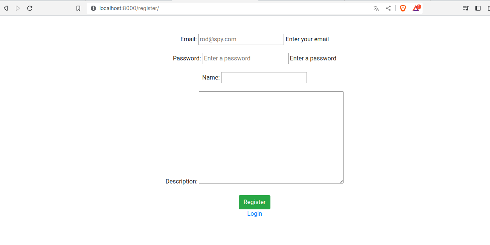
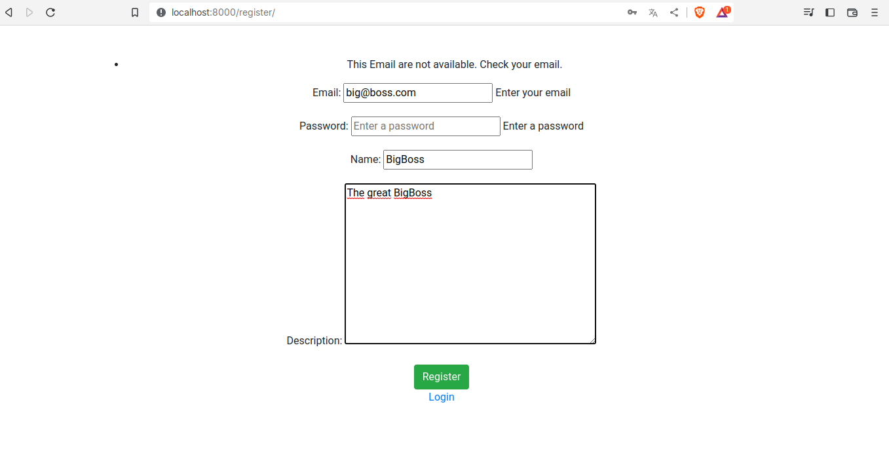
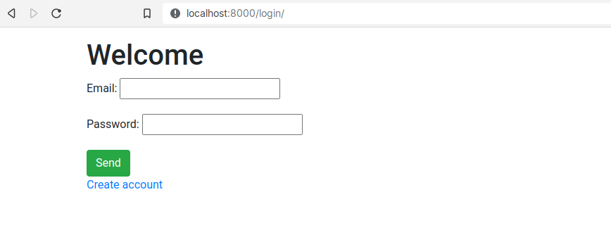
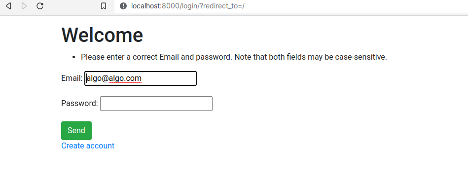
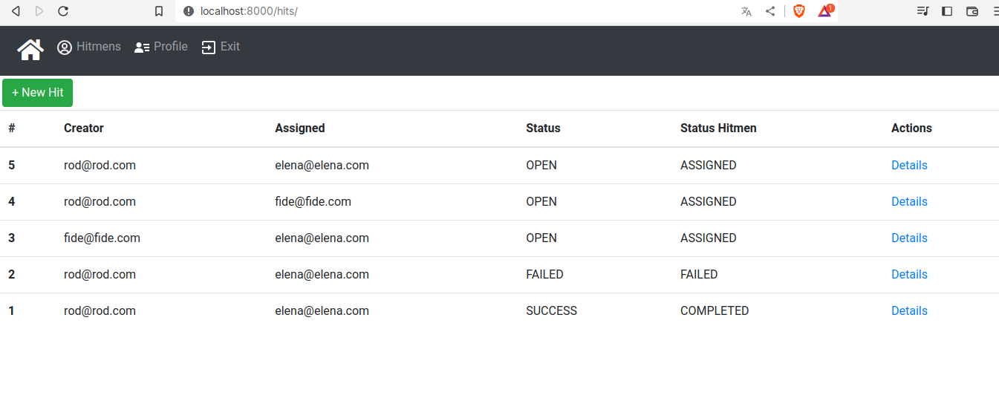
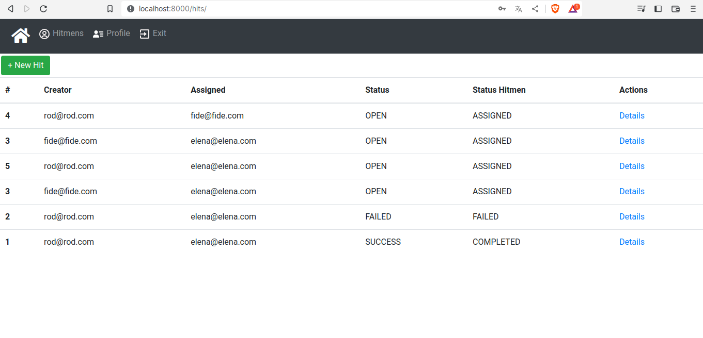
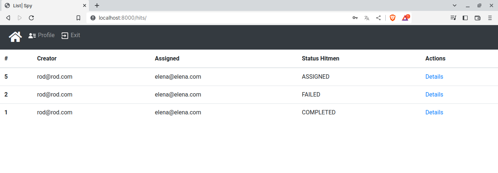
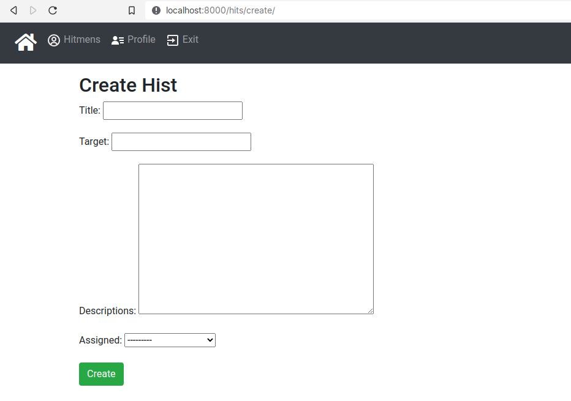
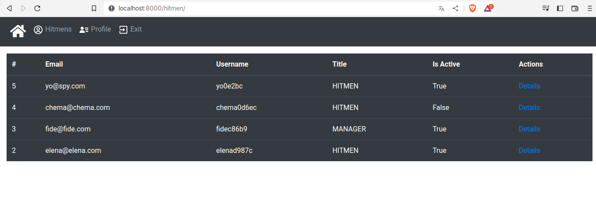

## Documentation

### Register
For register an account, only we need ceratin data like:
- email
- password
- name
- description
Only we need email and password

*If a email already register, we show a message about that email*

### Login
Only we need email and password

The same case like register a hitmen, when to login a hitme does not exists, show a message

###  Hits
Depending on the type of user it will show different things of hits

#### BigBoss

#### Manager

#### Hitmen

### Create Hits
The difference between a BigBoos and Manager to create a hits.
If user is a BigBoss show all Hitmens and Managers.
If user is a Manager only show his subordinates.
If user is a Hitmen he can not watch this view.

### List Hitmens
The difference between a BigBoos and Manager to create a hits.
If user is a BigBoss show all Hitmens and Managers.
If user is a Manager only show his subordinates.
If user is a Hitmen he can not watch this view.

